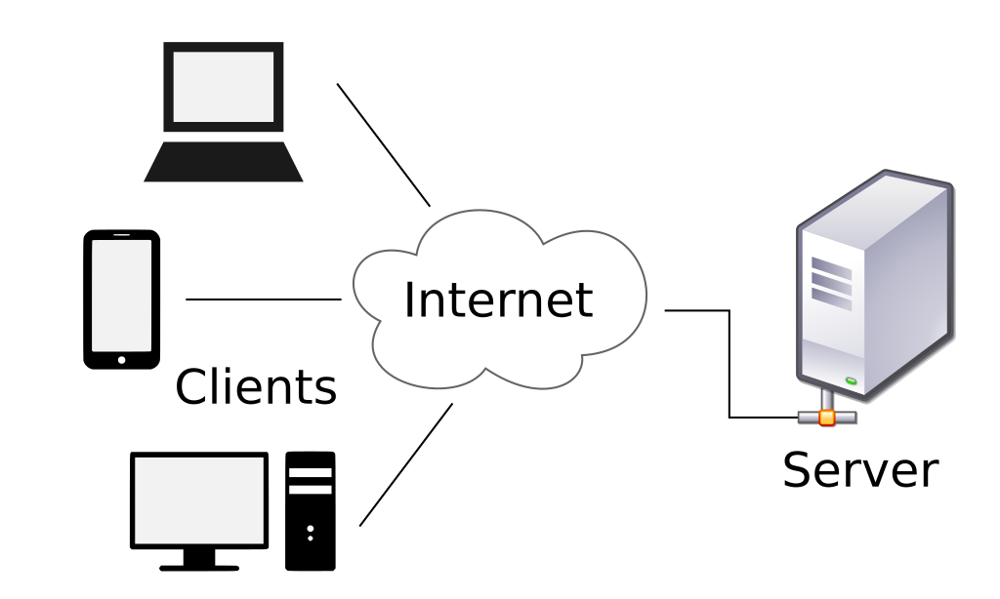
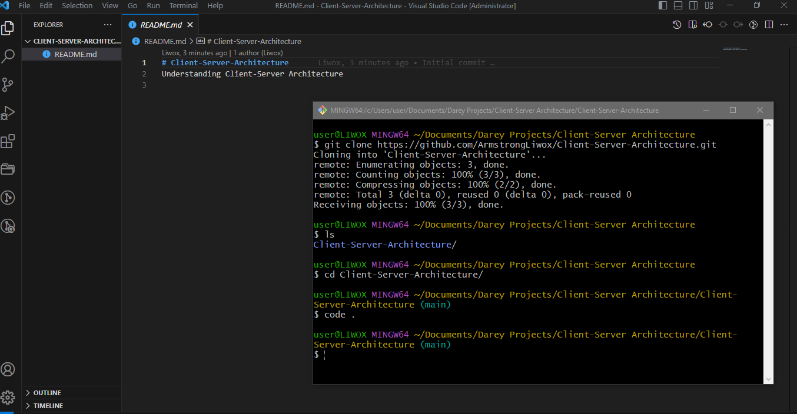
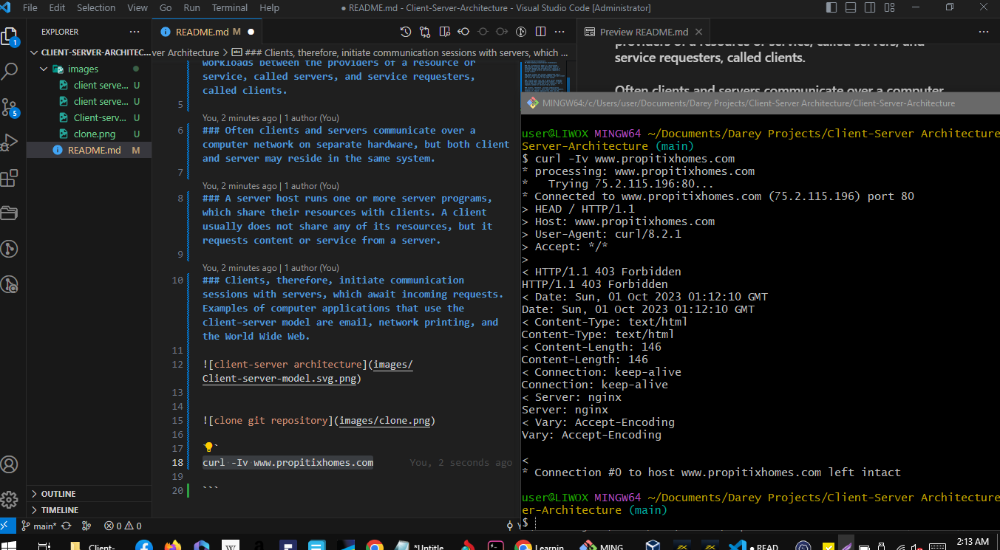

# Client-Server-Architecture
## Understanding Client-Server Architecture

### The client–server model is a distributed application structure that partitions tasks or workloads between the providers of a resource or service, called servers, and service requesters, called clients.

### Often clients and servers communicate over a computer network on separate hardware, but both client and server may reside in the same system. 

### A server host runs one or more server programs, which share their resources with clients. A client usually does not share any of its resources, but it requests content or service from a server. 

### Clients, therefore, initiate communication sessions with servers, which await incoming requests. Examples of computer applications that use the client–server model are email, network printing, and the World Wide Web.


---

---

---



> Run curl command 

```
curl -Iv www.propitixhomes.com
```



> Ping
---
Ping is a computer network administration software utility used to test the reachability of a host on an Internet Protocol (IP) network. 
---
It is available for virtually all operating systems that have networking capability, including most embedded network administration software.
---
Ping measures the round-trip time for messages sent from the originating host to a destination computer that are echoed back to the source.
---
The name comes from active sonar terminology that sends a pulse of sound and listens for the echo to detect objects under water.
---
> Traceroute
---
In computing, traceroute and tracert are computer network diagnostic commands for displaying possible routes (paths) and measuring transit delays of packets across an Internet Protocol (IP) network.
---
---

# Implementing a Client-Server Architecture using MysQL DBMS

## Task : 

> Implementing a Client-Server Architecture using MysQL DBMS

1. Create and configure two EC2 instances on AWS servers:

Server A name - `mysql server`

Server B name - `mysql client`


2. Install Mysql Server software on mysql server Linux server

3. Install Mysql Client software on mysql client Linux server


